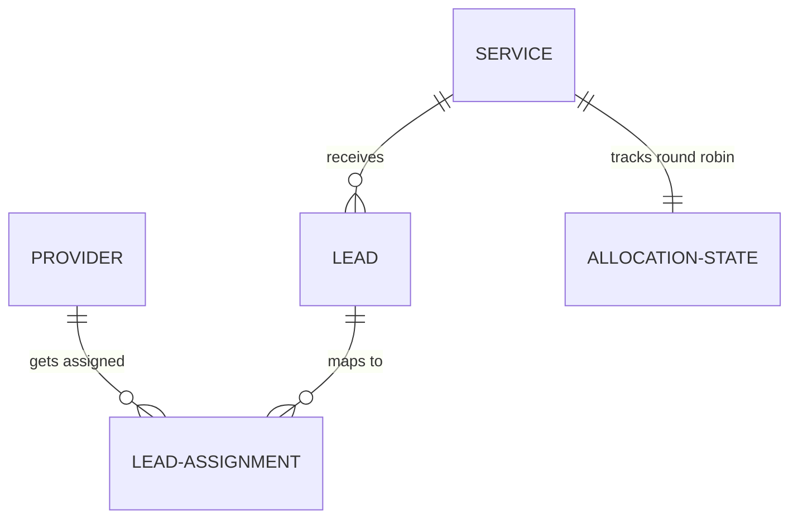

# Architecture Design Document

Welcome to the **Prowider Lead Distribution System** architecture blueprint. This document details the system design, components, database design, and topology of our production-grade implementation.

> [!NOTE]
> This system is built using Next.js (App Router), TypeScript, and Prisma ORM with a PostgreSQL database. It is designed to handle concurrency safely, guarantee exact-3 assignments per lead, and operate with zero quota leakage.

## System Topology & Flow

The system consists of three main interactive areas:
1. **Request Service (/request-service)**: Customer lead collection page.
2. **Provider Dashboard (/dashboard)**: Real-time lead monitoring interface for providers.
3. **Test Tools (/test-tools)**: Simulated tools for triggering concurrency tests, quota resets via webhook, and multiple webhook idempotency executions.

```mermaid
graph TD
    Client[Customer /request-service] -->|POST Lead| API[Next.js API Route: /api/lead]
    API -->|Transaction + SELECT FOR UPDATE| DB[(PostgreSQL Database)]
    DB -->|Trigger AllocationEngine| Engine[Allocation Engine]
    Engine -->|Persistent Round Robin| DB
    Engine -->|Real-time update event| SSE[SSE / Polling Server]
    SSE -->|Auto-refresh| Dash[Dashboard /dashboard]
    Webhook[Test-Tools / webhook] -->|Idempotent eventId| WebhookAPI[/api/webhook/subscription]
    WebhookAPI -->|Reset Quota| DB
```

## Database Design

The database schema is fully normalized and enforces strict constraints at the engine level to ensure consistency:

* **Service**: Represents different service categories (e.g., Service 1, Service 2, Service 3).
* **Provider**: Represents lead-handling providers with quota rules (`monthlyQuota` and `remainingQuota`).
* **Lead**: Represents user requests. Enforces a strict database constraint `UNIQUE(phone, serviceId)` to prevent duplicate entries.
* **LeadAssignment**: Stores successful lead assignments to specific providers. Includes composite unique key `UNIQUE(leadId, providerId)`.
* **AllocationState**: Stores persistent round-robin indexing markers per Service, surviving application restarts.
* **WebhookEvent**: Tracks webhook transaction IDs for strict HTTP idempotency guarantees.

### Schema Relationships


## Seed Data Rules
On startup, if no Services exist, the system automatically inserts:
- **Services**: `Service 1`, `Service 2`, `Service 3`
- **Providers**: 8 providers, named `Provider 1` to `Provider 8`, each initialized with `monthlyQuota = 10` and `remainingQuota = 10`.
