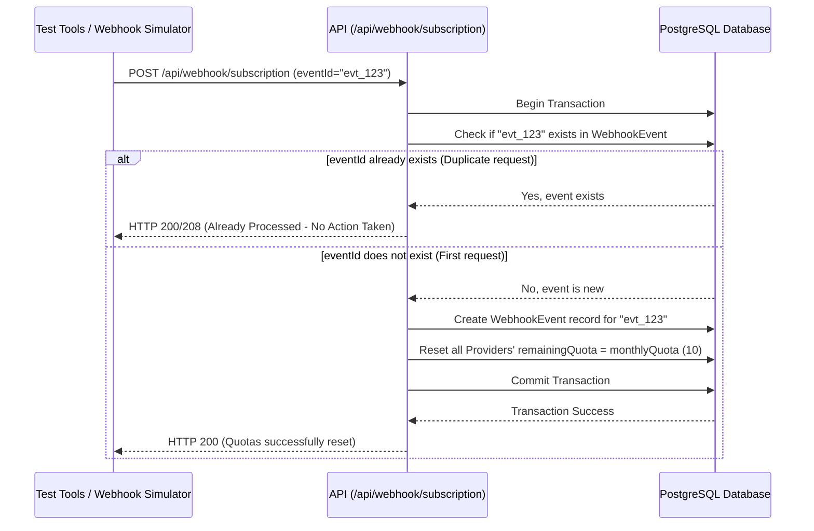

# Webhook Idempotency Design

This document details the implementation of our idempotent subscription webhook, which handles quota resets without duplicate operations, even when hit multiple times by identical retries or network double-posts.

> [!NOTE]
> The system implements a robust transactional idempotency key pattern using a dedicated `WebhookEvent` table.

## The Idempotency Key Pattern

To guarantee that multiple webhook calls with the same event trigger the quota reset exactly **once**, we implement the following flow:

## Idempotency Engine Code Logic

The webhook API route checks for the existence of `eventId` inside a database transaction to prevent race conditions during simultaneous webhook delivery:

1. **Parameter Validation**: Reject any requests that do not supply a valid `eventId` in the body.
2. **Transaction Lookup**:
   - Query the `WebhookEvent` table using the primary key `eventId`.
   - If a record is found:
     - Terminate immediately and return an `already-processed` code status (e.g. `200 OK` or `208 Already Reported`) containing the details of the original process time.
3. **Execution**:
   - Insert `eventId` into `WebhookEvent`.
   - Execute an atomic update to reset the `remainingQuota` of all providers to `monthlyQuota` (10).
   - Commit the transaction.

This guarantees that:
* **Duplicate network requests** (e.g., standard HTTP retries from a webhook broker) will result in a no-op, preserving system efficiency.
* **Simultaneous retries** of the exact same event are resolved safely at the database constraint level.
